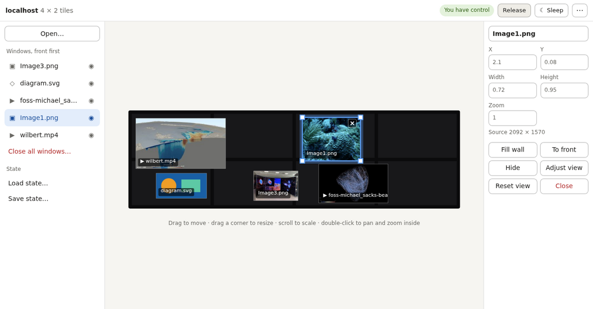

# Remote control

DisplayCluster can be controlled from other machines: from a web browser
(including as an app on a phone or tablet), from Python scripts, and from
anything that speaks HTTP. All three go through the same HTTP/JSON API,
served by the wall's master process (rank 0). A browser extension uses the
same port to show a live browser tab on the wall.

- [Setting up the wall](#setting-up-the-wall)
- [The web UI](#the-web-ui)
- [On a phone or tablet](#on-a-phone-or-tablet)
- [Streaming a browser tab](#streaming-a-browser-tab)
- [Scripting with DC.py](#scripting-with-dcpy)
- [Control: one at a time](#control-one-at-a-time)
- [The screensaver](#the-screensaver)
- [API reference](#api-reference)

## Setting up the wall

The API is configured with environment variables, set where the wall is
started (`startdisplaycluster` passes them on to the wall's processes):

| Variable | Default | What it does |
|---|---|---|
| `DISPLAYCLUSTER_API_TOKEN` | read from `~/.displaycluster/api_token`, if that exists | a shared secret every client must present |
| `DISPLAYCLUSTER_API_PORT` | `1910` | the port the API and web UI are served on |
| `DISPLAYCLUSTER_API_BIND` | all interfaces with a token; `127.0.0.1` without | the address the API listens on |
| `DISPLAYCLUSTER_STATE_DIR` | `~/.displaycluster/states` | where state files are loaded from and saved to |
| `DISPLAYCLUSTER_MEDIA_DIRS` | your home directory | the directories the file browser shows |
| `DISPLAYCLUSTER_UI_DIR` | `<install prefix>/ui` | where the web UI's files are |
| `DISPLAYCLUSTER_TIMEOUT` | `5` | seconds without activity before the screensaver starts |

`~` is the home directory of the account that runs the wall. Under apptainer
that's the same home directory as outside the container.

### The token

Without a token the API is only reachable from the wall's own machine. To
control the wall from anywhere else, generate a token:

```bash
python3 -c "import secrets; print(secrets.token_hex(32))"
```

and give it to the wall, either in the environment it's started from:

```bash
export DISPLAYCLUSTER_API_TOKEN="<the token>"
```

or in a file, readable only by you:

```bash
mkdir -p ~/.displaycluster && chmod 700 ~/.displaycluster
echo "<the token>" > ~/.displaycluster/api_token && chmod 600 ~/.displaycluster/api_token
```

Restart the wall. Its startup output should say
`remote API listening on 0.0.0.0:1910 (token required)`. Clients need the
same token — see each section below for where it goes. To revoke access,
change the token and restart the wall.

The token travels unencrypted over plain HTTP. On a network you don't
trust, use an SSH tunnel (below) or a TLS-terminating reverse proxy.

### Reaching the wall

Clients connect to the wall's host on the API port, so that port has to be
open. On RHEL-family systems:

```bash
sudo firewall-cmd --permanent --add-port=1910/tcp && sudo firewall-cmd --reload
```

A client that times out, rather than being refused, is almost always being
blocked by a firewall. To check from another machine:

```bash
curl http://wallhost:1910/ui/
```

(or, on Windows, `Test-NetConnection wallhost -Port 1910` in PowerShell).

Where the port can't be opened, an SSH tunnel works from any machine you can
SSH from, whether the wall has a token or not:

```bash
ssh -L 1910:localhost:1910 you@wallhost
```

Then use `localhost` in place of `wallhost`: `http://localhost:1910/ui/`,
`DC('localhost')`.

### Content and state directories

The file browser shows the directories in `DISPLAYCLUSTER_MEDIA_DIRS`,
separated like `PATH` (`:`, or `;` on Windows), each optionally given a name:

```bash
export DISPLAYCLUSTER_MEDIA_DIRS="content=/home/vislab/Content:movies=/scratch/movies"
```

An unnamed directory is named after its last component. Symbolic links are
followed only if they lead into one of these directories.

State files loaded and saved remotely are confined to
`DISPLAYCLUSTER_STATE_DIR`, and are named relative to it (`demo.dcx`, not
`/home/vislab/Content/demo.dcx`). The control window's own Load State and
Save State aren't limited this way.

## The web UI

Open `http://wallhost:1910/ui/` in a browser and enter the token. With
**Remember on this device** ticked, the browser keeps it.



The page shows the wall as it is right now, and follows every change,
whoever makes it: another browser, a script, or the control window.

### Taking control

Anyone with the token can watch. To change anything, press **Take control**
in the top bar — see [Control: one at a time](#control-one-at-a-time). The
top bar shows who has control. **Release** gives it back.

### The wall view

The wall is drawn dark, like the wall itself switched off, with its screens
and the gaps between them to scale. Each window shows a thumbnail of its
content (images, SVGs, and a frame from each movie), or an icon for its type
if there isn't one. Hidden windows are faded.

| To | With a mouse | With touch |
|---|---|---|
| select a window | click it (also brings it to the front) | tap it |
| move it | drag it | tap it, then drag it |
| resize it | drag a corner handle | drag a corner handle |
| scale it | scroll over it | pinch it |
| close it | the ✕ on the selected window | the ✕ on the selected window |
| pan and zoom its content | double-click it, then drag to pan and scroll or right-drag to zoom; double-click again or press Esc when done | double-tap it, then drag to pan and pinch to zoom; double-tap when done |
| zoom the view itself | ctrl+scroll (or pinch a trackpad) | pinch empty space |
| reset the view | double-click empty space | double-tap empty space |
| deselect | click empty space, or Esc | tap empty space |

When the wall keeps content in proportion (**Keep content aspect ratio** in
the options), resizing does too. Zooming the view only changes what your
screen shows, so it doesn't need control.

### The window list and inspector

The list on the left shows the windows front first; the eye beside each
hides or shows it. **Close all windows…** clears the wall.

The inspector shows the selected window's exact position, size and zoom (in
tiles: `(0, 0)` is the wall's top-left corner), and lets you change them,
rename the window, and:

- **Fill wall** — make it as large as fits, centered and in front. It then
  reads **Restore**, which puts it back where it was, and at its old place in
  the stacking order; so does selecting another window, or deselecting it.
  Moving or resizing a filled window keeps the new placement instead.
- **To front**, **Hide** / **Show**, **Close**.
- **Adjust view** — the same as double-clicking the window: pan and zoom its
  content. **Reset view** shows all of it again.

### Opening content

**Open…** browses the media directories: pick a location on the left, open
folders, sort by name, date or size, and open a file. **Open folder as grid**
opens the files in the current folder tiled across the wall, like the control
window's Open Contents Directory.

**Load state…** and **Save state…** list and write state files in the state
directory.

### Options

The **⋯** menu has the control window's View options (window borders,
content labels, test pattern, mullion compensation and so on) and
**Disconnect and forget token**.

## On a phone or tablet

The web UI works in a phone's or tablet's browser, and can be installed as a
home-screen app that opens full screen, with no browser bars.

On an iPhone or iPad:

1. Open **Safari** (it has to be Safari) at `http://wallhost:1910/ui/`.
2. Tap **Share** (in Safari's toolbar, or under **⋯** beside the address), then
   **Add to Home Screen**. The app is named after the wall's host —
   `rattler` for `rattler.tacc.utexas.edu` — and can be renamed here.
3. Open it from the home screen and enter the token, with **Remember on this
   device** ticked. Pasting it (from Notes or Messages) saves typing it.

Enter the token in the installed app, not in Safari first: a home-screen app
has its own storage, separate from Safari's. It keeps the token from then on,
unless the app is removed or the wall's token changes. Several walls can
each have their own app.

On Android, Chrome only installs full-screen apps from HTTPS sites; over plain
HTTP, **Add to Home screen** makes a shortcut that opens in a browser tab.

On narrow screens the side panels become sheets, opened from the bar at the
bottom.

## Streaming a browser tab

The DisplayCluster Streamer extension, in `extension/`, shows a browser tab on
the wall, live: a dashboard, a web visualization, a slide deck. You use the
tab as normal on your own computer, and the wall shows what it shows. It works
in Chrome and Edge (version 116 or later); Firefox and Safari don't have the
tab capture it needs.

It does DesktopStreamer's job for a single tab, with nothing to install but
the extension: it sends the tab to the wall's `/stream` WebSocket, on the same
port and with the same token as the web UI (see [Streaming](#streaming)).

### Installing it

The extension isn't in the Chrome Web Store, so it's loaded from a copy of
the `extension/` folder:

1. Open `chrome://extensions` (in Edge, `edge://extensions`).
2. Turn on **Developer mode**.
3. Click **Load unpacked** and choose the `extension` folder.
4. Pin it to the toolbar: the puzzle-piece button, then the pin beside
   **DisplayCluster Streamer**.
5. Its options page opens from the extension's **⋮** menu → **Options**, or
   from **Set up…** in its popup. Enter the wall's address (a host name, such
   as `rattler.tacc.utexas.edu`; port 1910 is assumed) and its token, then
   **Save**. Chrome asks to let the extension contact that address, which
   **Test connection** needs; streaming works either way, but with it an
   error can say exactly what went wrong.

Chrome keeps the extension, and the settings, until it's removed. If the
folder is moved or deleted, Chrome disables it; load it again from the new
place.

### Using it

1. In the tab to show, click the extension's button.
2. Change the **Window name** if you like; it starts as the tab's title.
3. Click **Start streaming**. The window opens on the wall, and the button
   shows **ON** for that tab.

**Stop streaming** in the same popup, or closing the tab, closes the window
on the wall. **Alt+Shift+W** starts or stops streaming the current tab without
opening the popup (it can be changed at `chrome://extensions/shortcuts`).
Several tabs can stream at once, each to its own window.

The tab keeps streaming when it's in the background, in another window, or
navigates to another page. Chrome shows its sharing indicator in the tab
while it does.

If it can't stream, the button shows a red **!**, and the popup says why: the
wall couldn't be reached (the address, the network, or its firewall), or the
wall refused the stream (usually the token). If another stream already has
the window name, it's shown as "Name (2)".

### The picture

- A tab is sent at its size on your screen, in screen pixels, up to the
  **Largest size** in the options (3840 by default). For a sharp picture on a
  large part of the wall, make the browser window large, or use a screen with
  more pixels.
- Resizing the window reshapes the picture on the wall, but keeps the number
  of pixels it started with; to get a sharper picture after making the window
  larger, stop and start streaming again.
- Frames are sent only when the page changes, up to the **Frame rate** in the
  options. A still page costs nothing, and the wall keeps showing it.
- Frames are JPEG, at the **Quality** in the options. Video plays, at the
  frame rate. There's no sound.
- While a tab is streaming, the wall stays awake.

## Scripting with DC.py

`python/DC.py` is a Python client, using only the standard library:

```python
from DC import DC

dc = DC('wallhost')                  # or DC() for this machine
print(dc.getConfiguration())         # (tiles wide, tiles high)

name = dc.open('/data/images/mars.jpg', x=0, y=0, w=2, h=2)
dc.reposition(name, 1, -1, -1, -1)   # -1 keeps a value as it is
dc.fill(name)                        # fill the wall...
dc.fill(name, False)                 # ...and put it back
dc.close(name)

dc.showContent()                     # print what's open
```

It finds the token in `$DISPLAYCLUSTER_API_TOKEN` or
`~/.displaycluster/api_token` (on the machine it runs on), or take it as
`DC('wallhost', token='...')`. The port is `$DISPLAYCLUSTER_API_PORT` or 1910.

Windows are named by their file's path unless given a name
(`dc.open(uri, name='mars')`); a file opened twice gets `#2`, `#3`, … on the
end. `open()` returns the name the window got. `dc.content` holds every window
by name: `{uri, x, y, w, h, hidden, filled}`, refreshed after every change or
by `dc.updateContent()`.

| Methods | |
|---|---|
| `open`, `close`, `clear`, `reposition`, `rename`, `hide`, `reveal`, `moveToFront`, `fill` | windows |
| `openDirectory(root, dir, cols, rows)` | a folder's files tiled across the wall |
| `mediaRoots()`, `listMedia(root, dir, sort, descending, offset, limit)` | browsing the media directories |
| `loadState(file)`, `saveState(file)`, `clearState()` | state files, relative to the state directory |
| `getOptions()`, `setOptions(**options)`, and `setConstrainAspectRatio`, `setShowWindowBorders`, `setShowContentLabels` | display options |
| `sleepWall()`, `wakeWall()`, `status()` | the screensaver, and who has control |
| `takeControl(force)`, `releaseControl()`, `disconnect()` | control, by hand |
| `create_event_list(script)`, `run_events(events)` | play a timed script of windows opening and closing |

Failures are printed and the script carries on; `DC(..., strict=True)` raises
`DCError` instead.

### Control in scripts

`DC` takes control of the wall the first time it changes something, and gives
it back when the script exits (or at `dc.disconnect()`). Reading needs no
control. Its control lapses after 30 seconds without a request; `DC` takes it
back the next time it changes something, as long as nobody else has taken it
meanwhile.

If someone else has control, the script's changes are refused (and printed as
errors) — so a script doesn't override a person using the wall. `DC(...,
force=True)` takes control regardless. `label=` names the script, which is
what the control window's banner and other clients show while it has control.

A script that makes a change and then waits a long time should give control
back straight away, so it doesn't lock other clients out for the next 30
seconds:

```python
dc = DC(label='cyclestates')

while True:
    for state in ['antarctic.dcx', 'Gulf.dcx', 'webb3.dcx']:
        dc.loadState(state)
        dc.releaseControl()
        sleep(900)
```

## Control: one at a time

Only one client can change the wall at a time — a browser, a script, or the
control window.

- A client **takes control**, and then holds it for as long as it's active.
  Control **lapses after 30 seconds** without a request from it (an open web
  UI keeps it alive through its live connection).
- Taking control from someone who has it asks for confirmation in the web UI,
  and takes `force=True` in `DC.py`.
- While a remote client has control, the **control window is read-only** but
  still shows the wall as it changes, with a banner naming who has control and
  a **Take control** button to take it back.
- Watching needs no control: any number of browsers can follow the wall.

## The screensaver

The wall goes to sleep after `DISPLAYCLUSTER_TIMEOUT` seconds without
activity, showing `DISPLAYCLUSTER_SCREENSAVER_IMAGE` bouncing around, and
wakes when someone uses it.

- Changes from anywhere wake the wall and count as activity. Only watching
  doesn't, so an open browser tab doesn't keep the wall awake.
- While a remote client has control, the wall's own idle timer is paused and
  the client decides when it sleeps: the web UI puts it to sleep after the
  same timeout without input. When control ends, the wall's timer starts
  again.
- In the web UI, **Sleep** puts the wall to sleep. While it's asleep, the wall
  view greys out over the layout that will come back; a click or key wakes it.
  Anyone can wake the wall, with or without control.

## API reference

Every request carries the token, as `Authorization: Bearer <token>`. (A
browser's `EventSource` and `WebSocket` can't send headers, so `/events` and
`/stream` also accept it as `?access_token=`.) Changes also carry the control lease, as
`X-DC-Lease: <lease>`. Bodies and replies are JSON; errors come back with a
4xx status and `{"error": "..."}`.

Windows are named in URLs percent-encoded (`/` as `%2F`, `#` as `%23`).
Coordinates are in tile units: `(0, 0)` is the wall's top-left corner and
`(tilesWide, tilesHigh)` its bottom-right.

### Status and control

| Request | Body | Returns / does |
|---|---|---|
| `GET /status` | | `{asleep, idleTimeout, controller}`; `controller` is `{id, label}` or null |
| `GET /events` | `?lease=` optionally | server-sent events: `{status, windows, options}`, now and whenever they change (at most ten times a second) |
| `POST /control` | `{label?, force?}` | take control: `{lease, id, label, timeout}`; `423` naming the holder if someone has it and `force` isn't set |
| `POST /control/heartbeat` | | keep control while idle |
| `DELETE /control` | | give control back |
| `POST /sleep` | | start the screensaver (needs control) |
| `POST /wake` | | end it (needs no control) |

### The wall and its windows

| Request | Body | Returns / does |
|---|---|---|
| `GET /config` | | size in tiles and pixels, screen and mullion sizes, version |
| `GET /windows` | | every window, back to front (while asleep, the layout waking will restore) |
| `POST /windows` | `{uri, name?, x?, y?, w?, h?}` | open a file |
| `POST /windows/directory` | `{root, dir?, cols?, rows?}` | open a folder's files tiled across the wall; without `cols`/`rows`, a grid that fits them (up to 36) |
| `DELETE /windows` | | close every window |
| `GET /windows/{name}` | | one window |
| `PATCH /windows/{name}` | any of `{x, y, w, h, hidden, front, zoom, centerX, centerY, name, filled}` | change a window |
| `DELETE /windows/{name}` | | close a window |
| `GET /windows/{name}/thumbnail` | | a small JPEG of its content |

A window is:

```json
{"name": "mars", "uri": "/data/images/mars.jpg",
 "x": 0.0, "y": 0.0, "w": 2.0, "h": 1.5, "z": 3,
 "hidden": false, "filled": false,
 "zoom": 1.0, "centerX": 0.5, "centerY": 0.5,
 "contentWidth": 4096, "contentHeight": 3072,
 "thumbnail": "/windows/mars/thumbnail?v=1727541234000"}
```

`z` is its place in the stacking order, from the back. `zoom`, `centerX` and
`centerY` are the view of its content: `zoom` 1 shows all of it, and the
center is in content fractions. `filled: true` makes a window as large as
fits, centered and in front, remembering where it was; `false` puts it back.
`thumbnail` is null for content that has none (image pyramids, streams, and
images too big to decode cheaply); its URL changes when the file does.

### Options and state

| Request | Body | Returns / does |
|---|---|---|
| `GET /options`, `PATCH /options` | any of `constrainAspectRatio`, `showWindowBorders`, `showContentLabels`, `showTestPattern`, `enableMullionCompensation`, `showZoomContext`, `enableStreamingSynchronization`, `showStreamingSegments`, `showStreamingStatistics`, as booleans | the display options |
| `GET /state` | | state files in the state directory, newest first |
| `POST /state/load` | `{file}` | load a state file |
| `POST /state/save` | `{file}` | save one (`.dcx` is added if missing) |

### Browsing

| Request | Returns |
|---|---|
| `GET /media` | the media directories: `[{name, path}]` |
| `GET /media/{root}?dir=&sort=&order=&offset=&limit=` | a page of a directory: `{root, dir, parent, total, offset, entries}` |

`sort` is `name`, `modified` or `size`, `order` `asc` or `desc`, and pages are
up to 1000 entries (200 by default). Folders come first. Each entry has
`name`, `type` (`directory`, `image`, `movie`, `svg` or `pyramid`) and
`modified`, and either `dir` (to list next) or `uri` and `size` (to open).
Only files the wall can open are listed, unless `all=true`, which lists the
rest too, with `type` `other` and no `uri`.

### Streaming

`/stream/{name}` is a WebSocket that puts a live picture on the wall, as
DesktopStreamer does, for senders that can't use DesktopStreamer's own
protocol, such as a browser. Each binary message is one whole frame, a JPEG of
any size. The first frame opens a window named `{name}`, later ones replace
the picture, and the window closes when the connection does.

- The server answers each frame with a text message, `ack`. Waiting for it
  before sending the next frame keeps frames from queueing up.
- Send frames only when the picture changes. An open connection keeps the wall
  awake, frames or not: it wakes the wall when it opens and counts as activity
  until it closes.
- Names are cut to 63 bytes. A second connection with the name of a stream
  already on the wall is closed with code 1008; a frame that isn't a JPEG
  closes the connection with code 1007.
- Streaming needs no control: a stream adds its own window and changes no one
  else's.

In Python, with the `websocket-client` package:

```python
import websocket

ws = websocket.create_connection("ws://wallhost:1910/stream/My%20screen?access_token=" + TOKEN)
for jpeg in frames:
    ws.send_binary(jpeg)
    ws.recv()           # "ack"
ws.close()              # the window closes
```

### Needing control

`POST`, `PATCH` and `DELETE` on `/windows…` and `/options`, and
`POST /state/load` and `/sleep`, need control. Everything else doesn't.

### With curl

```bash
TOKEN=...
LEASE=$(curl -s -H "Authorization: Bearer $TOKEN" -X POST http://wallhost:1910/control \
        -d '{"label": "curl"}' | python3 -c "import json,sys; print(json.load(sys.stdin)['lease'])")
curl -H "Authorization: Bearer $TOKEN" -H "X-DC-Lease: $LEASE" -X POST http://wallhost:1910/windows \
     -d '{"uri": "/data/images/mars.jpg", "name": "mars", "x": 0, "y": 0, "w": 2, "h": 2}'
curl -H "Authorization: Bearer $TOKEN" -H "X-DC-Lease: $LEASE" -X DELETE http://wallhost:1910/control
```
